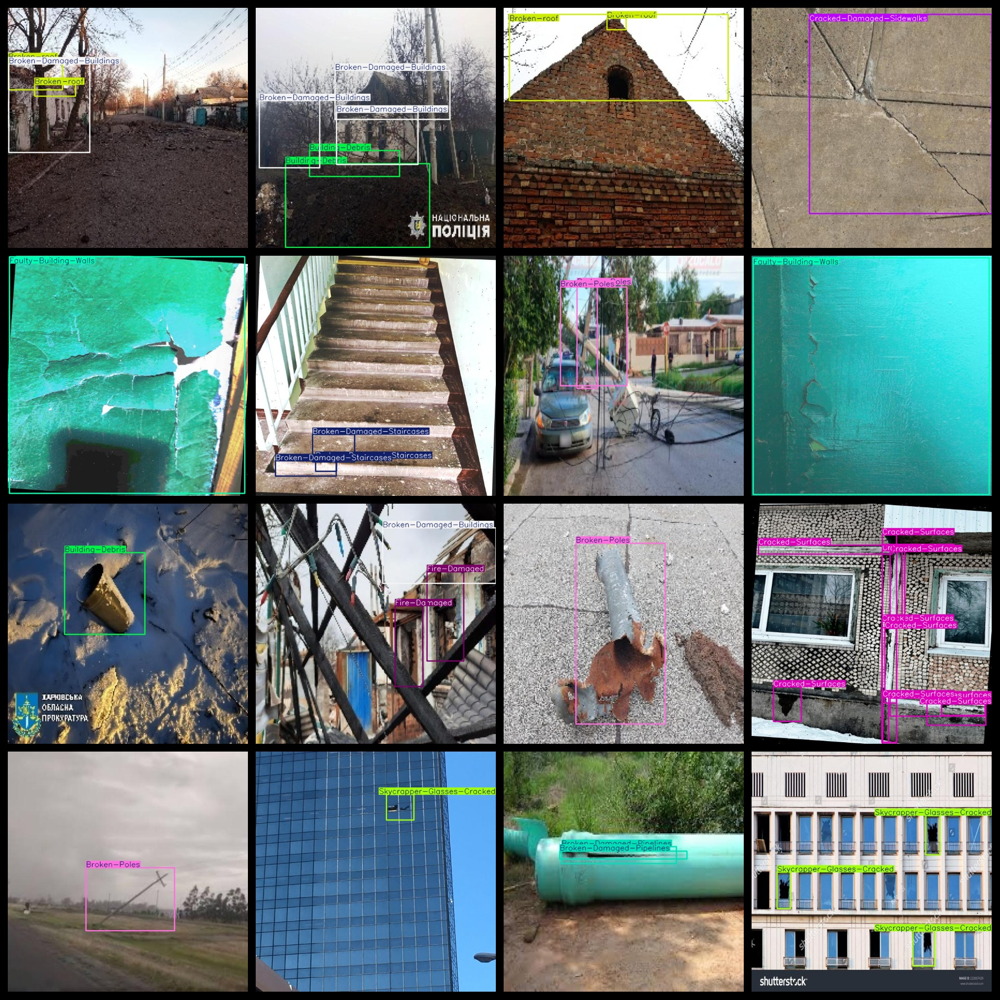
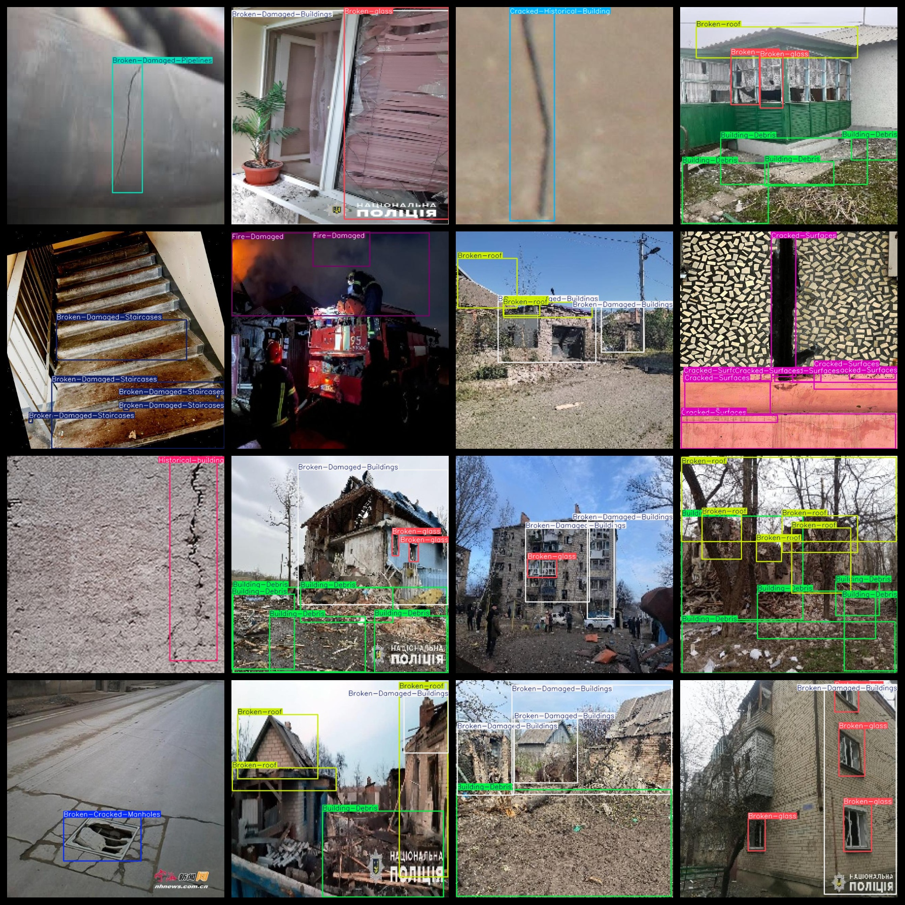

# Urban Foundation Equipment Defect Detection Dataset 8887 imagesVOC+YOLO format

Urban infrastructure equipment defect detection data set 8887 VOC + YOLO format

Dataset Format: Pascal VOC + YOLO (excluding the split-path txt file; only jpg images with corresponding VOC-format xml files and YOLO-format txt files)

Total number of images (number of jpg files): 8,887

Number of xml files: 8,887

Number of txt files: 8887

Number of categories: 20

The Github repository is: datasets_sl

["Broken-Cracked-Manholes", "Broken-Damaged-Bridges", "Broken-Damaged-Buildings", "Broken-Damaged-Pipelines", "Broken-Damaged-Staircases", "Broken-Poles", "Broken-glass", "Broken-roof", "Building-Debris", "Cracked-Damaged-Sidewalks", "Cracked-Historical-Building", "Cracked-Surfaces", "Damaged-Railway", "Damaged-roads", "Faulty-Building-Walls", "Faulty-Shipping-Container", "Fire-Damaged", "Historical-building", "Railway-tracks", "Skycrapper-Glasses-Cracked"]

Number of boxes labeled in each category:

Broken-Cracked-Manholes box count = 1114 Broken/cracked manhole covers

Broken-Damaged-Bridges = 211 Broken/Damaged Bridges

Broken-Damaged-Buildings Number of Boxes = 5803 Broken/Damaged Buildings

Broken-Damaged-Pipelines Box = 745 Broken/Damaged Pipelines

Broken-Damaged-Staircases Number of Boxes = 2014 Broken/Damaged Stairs

Number of Broken-Poles = 1395 fractured/broken utility poles

Broken-glass number of frames = 3630 Broken glass

Broken-roof number of frames = 1629 Broken roof

Building-Debris number of frames = 3796 Building debris (or building wreckage)

Cracked-Damaged-Sidewalks Box = 421 Cracked/Damaged Sidewalks

Cracked-Historical-Building Number of Frames = 1833 Cracked Historical Buildings

Cracked-Surfaces box number = 4382 Cracked surfaces

Damaged-Railway Number of Boxes = 457 Damaged Railways

Damaged-roads number of boxes = 4124 Damaged roads

Faulty-Building-Walls number of boxes = 1508 Faulty walls

Faulty-Shipping-Container number of boxes = 790 faulty containers

Fire-Damaged Box = 575 Fire Damaged (Buildings/Facilities)

Historical-building number of frames = 2701 Historical buildings

Railway-tracks number of boxes = 1 railway track

Skycrapper-Glasses-Cracked Number of Frames = 149 Building Glass Cracks

Total frames: 37278

Number of images per category:

Broken-Cracked-Manholes have 299 photos.

Broken-Damaged-Bridges occupies a photo count = 95

Broken-Damaged-Buildings occupies a picture count = 2826

Broken-Damaged-Pipelines occupies a total of 210 images.

Broken-Damaged-Staircases occupies 297 images.

Broken-Poles have 730 images.

Broken-glass occupies 988 images.

Broken-roof occupancy = 808

Building-debris ownership count = 2109

Cracked-Damaged-Sidewalks occupies a total of 300 pictures.

The number of photographs owned = 350

Cracked-Surfaces have 898 images.

Damaged-Railway occupies = 148

Damaged-roads' possession of images = 398

Faulty-Building-Walls occupies a total of 897 images.

Faulty-Shipping-Container occupies 199 images.

Fire-Damaged Pictures Count = 291

Historical-building occupancy = 299

Railway-tracks occupies = 1

Skycrapper-Glasses-Cracked-Occupy-Images-Count = 100

Image resolution: 640x640
## Images

---

Here is a pay link on Stripe (https://buy.stripe.com/3cs8yP7sY87d0vu9AB). Please contact me lonlonago@foxmail.com after funding $89, and I will send you a complete data files, thank you!

